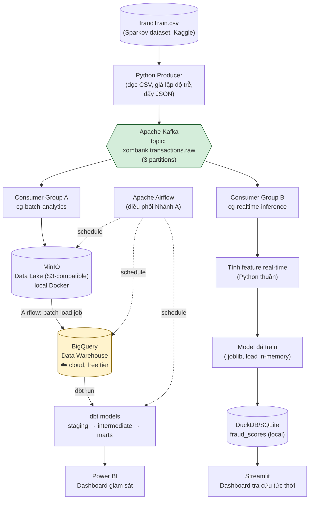
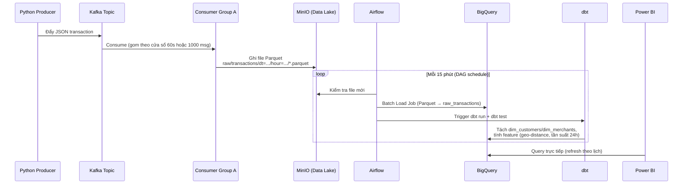
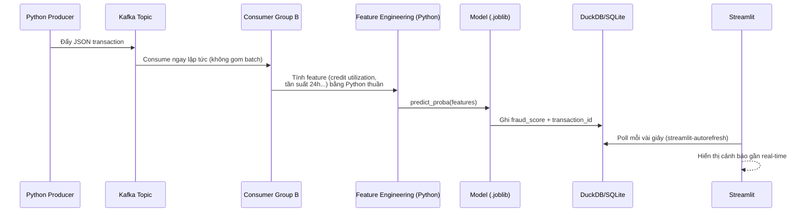

# 🏦 Xóm Bank — Real-time Fraud Detection & Credit Analytics Pipeline

> Hệ thống phát hiện gian lận giao dịch thẻ tín dụng kết hợp streaming (Kafka) và batch analytics (BigQuery + dbt), với 2 luồng xử lý độc lập: giám sát rủi ro tổng thể (Power BI) và tra cứu tức thời từng giao dịch (Streamlit).

**Trạng thái:** ✅ Đã hoàn thành 100% (Production-Ready) — 22/22 Automated Tests PASS
**Mục đích:** Học sâu Kafka / BigQuery / Airflow / dbt / LightGBM + Xây dựng Portfolio Senior Data Analyst / Analytics Engineer
**Chi phí vận hành:** $0 (100% local qua Docker + BigQuery Sandbox miễn phí)

---

## 📋 Mục lục

1. [Tổng quan dự án](#1-tổng-quan-dự-án)
2. [Dataset](#2-dataset)
3. [Kiến trúc tổng thể](#3-kiến-trúc-tổng-thể)
4. [Luồng dữ liệu chi tiết](#4-luồng-dữ-liệu-chi-tiết)
5. [Chi tiết từng tầng hệ thống](#5-chi-tiết-từng-tầng-hệ-thống)
6. [Chiến lược Machine Learning](#6-chiến-lược-machine-learning)
7. [Kiểm soát chi phí](#7-kiểm-soát-chi-phí)
8. [Cấu trúc thư mục dự án](#8-cấu-trúc-thư-mục-dự-án)
9. [Công nghệ sử dụng](#9-công-nghệ-sử-dụng)
10. [Hướng dẫn cài đặt & chạy](#10-hướng-dẫn-cài-đặt--chạy)
11. [Roadmap triển khai theo Phase](#11-roadmap-triển-khai-theo-phase)
12. [Tiêu chí đánh giá thành công](#12-tiêu-chí-đánh-giá-thành-công)
13. [Hướng mở rộng trong tương lai](#13-hướng-mở-rộng-trong-tương-lai)
14. [Bài học & thử thách kỹ thuật](#14-bài-học--thử-thách-kỹ-thuật)

---

## 1. Tổng quan dự án

### 1.1 Bài toán

Xóm Bank là ngân hàng bán lẻ + phát hành thẻ, cần một hệ thống có khả năng:

- **Giám sát tổng thể** tỷ lệ gian lận theo thời gian (dashboard cho quản lý/risk team).
- **Đánh giá tức thời** một giao dịch bất kỳ có dấu hiệu gian lận hay không (phục vụ tra cứu nhanh).
- **Phân tích sâu** để hiểu đặc điểm của giao dịch gian lận: loại thẻ, MCC (merchant category), hành vi chi tiêu bất thường.

### 1.2 Mục tiêu dự án

| Mục tiêu | Chi tiết |
|---|---|
| Học sâu kỹ thuật | Kafka (consumer group, partition, offset), BigQuery (batch load, quota, cost model), Airflow (DAG dependency, scheduling) |
| Portfolio | Thể hiện tư duy end-to-end: từ ingestion → warehouse → ML → business decision → visualization |
| Business thinking | Không chỉ train model tốt, mà biết chọn threshold/model dựa trên **chi phí kinh doanh thực tế** (cost of False Positive vs False Negative) |

### 1.3 Đối tượng sử dụng hệ thống (giả định)

- **Risk/Fraud team:** xem Power BI dashboard để giám sát xu hướng gian lận theo thời gian, theo MCC, theo loại thẻ.
- **Hệ thống backend ngân hàng (giả lập qua Streamlit):** cần biết ngay 1 giao dịch có rủi ro cao hay không để quyết định approve/hold.

---

## 2. Dataset

> 🔄 **Đã thay đổi (21/08/2026):** Bộ dataset "banking" (Xóm Bank) ban đầu không tải được, đã thay thế bằng bộ dữ liệu bên dưới. Toàn bộ kiến trúc vẫn giữ nguyên, chỉ thay đổi cách tổ chức dữ liệu ở tầng nguồn và bổ sung 1 bước chuẩn hóa trong dbt.

### 2.1 Nguồn gốc

**"Credit Card Transactions Fraud Detection Dataset"** (dữ liệu mô phỏng bằng công cụ **Sparkov Data Generation**), tác giả Kartik Shenoy, đăng trên Kaggle.

- **Link:** https://www.kaggle.com/datasets/kartik2112/fraud-detection
- **License:** CC0 — Public Domain
- **Độ tin cậy truy cập:** ~587K lượt xem, ~110K lượt tải, được đánh giá "Well-documented", "Well-maintained", "Clean data" trên Kaggle — rủi ro không tải được thấp hơn nhiều so với bộ cũ.
- **Mirror dự phòng** (nếu Kaggle vẫn khó truy cập): `https://huggingface.co/datasets/SquareBracket/fraud_detection` (có `fraudTrain.csv`, ~102MB, qua Git LFS).
- Dữ liệu mô phỏng giao dịch thẻ của **1.000 khách hàng** với **800 merchant**, trải dài từ 01/2019 đến 12/2020.

Dataset gồm 2 file, **chia theo mốc thời gian** (không phải random split) — rất phù hợp với kiến trúc streaming của dự án:

| File | Số dòng | Vai trò trong dự án |
|---|---|---|
| `fraudTrain.csv` | 1.296.675 | Nguồn cho Python Producer (giả lập streaming) + dữ liệu train model |
| `fraudTest.csv` | 555.719 | Giữ nguyên làm **hold-out set** đánh giá model cuối — mô phỏng đúng tình huống thực tế: model luôn phải dự đoán trên dữ liệu "tương lai" chưa từng thấy |

> 💡 Vì tổng ~1.85M dòng lớn hơn nhiều so với bộ cũ (165K), nên cân nhắc: dùng toàn bộ `fraudTrain.csv` cho phần batch analytics/training (sklearn xử lý tốt), nhưng chỉ cho Producer stream 1 khoảng thời gian con (ví dụ 1–2 tháng dữ liệu) để demo Kafka không mất quá nhiều thời gian chạy.

### 2.2 Schema

Khác với bộ cũ (4 bảng đã chuẩn hóa sẵn), bộ này là **1 file phẳng (denormalized)** — mỗi dòng là 1 giao dịch, thông tin khách hàng và merchant lặp lại xuyên suốt. 22 cột, nhóm theo vai trò:

| Nhóm cột | Cột cụ thể | Vai trò trong kiến trúc |
|---|---|---|
| Giao dịch | `trans_num`, `trans_date_trans_time`, `unix_time`, `amt` | → **Fact table** (`fct_transactions`) |
| Khách hàng (lặp lại theo `cc_num`) | `cc_num`, `first`, `last`, `gender`, `street`, `city`, `state`, `zip`, `lat`, `long`, `city_pop`, `job`, `dob` | → dbt tách thành **Dim Customer** |
| Merchant (lặp lại theo `merchant`) | `merchant`, `category`, `merch_lat`, `merch_long` | → dbt tách thành **Dim Merchant** (đóng vai trò tương đương `mcc_codes` cũ, dùng `category` thay cho MCC) |
| Nhãn | `is_fraud` | → Ground truth cho ML |

**Tổng:** 1 file nguồn (denormalized) · ~1,85M dòng (train+test) · 22 cột → dbt build lại thành star schema (`dim_customers`, `dim_merchants`, `fct_transactions`).

> 📌 **Đây thực ra là bài tập modeling thực tế hơn bộ cũ:** dữ liệu thô ngoài đời hiếm khi đã được chuẩn hóa sẵn thành nhiều bảng — việc tự tách 1 file phẳng thành star schema bằng dbt (`SELECT DISTINCT` + surrogate key + dedup) là kỹ năng dbt/data modeling rất hay được hỏi khi phỏng vấn.

### 2.3 Chiến lược gán nhãn (Labeling)

Cột `is_fraud` đã có sẵn → dùng trực tiếp làm **ground truth**, không cần rule-based labeling như kế hoạch với bộ dữ liệu cũ (bộ cũ có sự không chắc chắn về nhãn thật).

Tuy vậy, dataset mới lại mở ra 1 feature phân tích rất giá trị mà bộ cũ không có: tọa độ (`lat`, `long`) của khách hàng và (`merch_lat`, `merch_long`) của merchant đi kèm mỗi giao dịch → có thể tính **khoảng cách địa lý (Haversine distance)** giữa nơi ở và nơi phát sinh giao dịch. Đây là 1 tín hiệu gian lận rất mạnh trong thực tế (giao dịch cách xa vị trí thường trú bất thường), và sẽ được đưa vào làm feature chính ở [Mục 6](#6-chiến-lược-machine-learning).

---

## 3. Kiến trúc tổng thể

### 3.1 Nguyên tắc thiết kế cốt lõi

Hệ thống được tách thành **2 nhánh xử lý độc lập** từ cùng một Kafka topic, vì hai bài toán có yêu cầu khác nhau về độ trễ:

| | Nhánh A — Batch Analytics | Nhánh B — Real-time Inference |
|---|---|---|
| Mục đích | Giám sát xu hướng tổng thể | Trả lời tức thời cho 1 giao dịch |
| Độ trễ chấp nhận được | Vài phút (near real-time) | Mili-giây đến vài giây |
| Nơi tính feature | dbt (SQL, trên BigQuery) | Python thuần (trong consumer) |
| Nơi phục vụ | Power BI | Streamlit |
| Kafka Consumer Group | `cg-batch-analytics` | `cg-realtime-inference` |

### 3.2 Sơ đồ kiến trúc tổng quan



### 3.3 Phân bổ Local vs Cloud

| Thành phần | Nơi chạy | Ghi chú |
|---|---|---|
| Kafka + Zookeeper/KRaft | 🖥️ Local (Docker) | |
| MinIO | 🖥️ Local (Docker) | Thay thế GCS, S3-compatible |
| Python Producer/Consumer | 🖥️ Local (Docker) | |
| Airflow | 🖥️ Local (Docker) | Không dùng Cloud Composer |
| Model training + inference | 🖥️ Local | |
| DuckDB/SQLite | 🖥️ Local | |
| Streamlit | 🖥️ Local (Docker) | |
| dbt-core | 🖥️ Local | Chỉ gửi SQL tới BigQuery, không cần cloud để chạy |
| Power BI Desktop | 🖥️ Local | Chỉ kết nối mạng tới BigQuery |
| **BigQuery** | ☁️ **Cloud** | **Duy nhất 1 điểm chạm cloud** — free tier |

---

## 4. Luồng dữ liệu chi tiết

### 4.1 Nhánh A — Batch Analytics (phục vụ Power BI)



**Đặc điểm quan trọng:** dùng **Batch Load Job**, KHÔNG dùng BigQuery Streaming Insert API — để tránh phát sinh phí ghi dữ liệu (xem mục 7).

### 4.2 Nhánh B — Real-time Inference (phục vụ Streamlit)



**Đặc điểm quan trọng — Feature Parity:** Công thức tính feature ở đây (Python) phải **khớp chính xác** với công thức đã dùng trong dbt lúc training, nếu không model sẽ nhận input sai lệch so với lúc học (training-serving skew).

---

## 5. Chi tiết từng tầng hệ thống

### 5.1 Ingestion — Python Producer + Kafka

- Producer đọc `fraudTrain.csv` theo thứ tự `trans_date_trans_time`, dùng `time.sleep()` với độ trễ ngẫu nhiên để giả lập tốc độ giao dịch thật, publish JSON vào Kafka. Có thể giới hạn stream trong 1 khoảng thời gian con của dataset (ví dụ 1–2 tháng) để demo không chạy quá lâu.
- Topic: `xombank.transactions.raw`, **3 partitions** (dù hiện tại 1 consumer/group cũng chạy được — chia partition từ đầu để có thể học/scale consumer sau này mà không cần đổi lại thiết kế).
- Key của message nên là `cc_num` (số thẻ) để đảm bảo cùng 1 khách hàng luôn được xử lý theo đúng thứ tự (partition ordering).
- **Công cụ hỗ trợ học tập:** thêm Kafka UI (`provectuslabs/kafka-ui` hoặc `kafdrop`) vào docker-compose để trực quan hóa topic, partition, consumer lag — rất hữu ích khi debug và khi cần demo hiểu biết về Kafka.

### 5.2 Storage — MinIO (Data Lake)

- Bucket: `xombank-datalake`
- Cấu trúc thư mục theo partition thời gian (Hive-style, thuận tiện cho load vào BigQuery):
  ```
  raw/transactions/dt=2026-08-21/hour=14/part-0001.parquet
  ```
- Dùng `boto3`/`s3fs` với `endpoint_url` trỏ về MinIO local — code viết y hệt như dùng S3/GCS thật, dễ dàng chuyển đổi sau này.

### 5.3 Warehousing — BigQuery

- Dataset: `xombank_dw`
- Bảng raw: `raw_transactions` (1 bảng duy nhất, denormalized — khớp với cấu trúc file nguồn)
- Nạp dữ liệu bằng **Batch Load Job** (miễn phí, không tính theo dung lượng ghi) — Airflow trigger định kỳ.

### 5.4 Transformation — dbt

Cấu trúc model theo chuẩn 3 lớp — vì nguồn là 1 file phẳng, lớp `intermediate` đảm nhiệm luôn việc **tách ngược thành star schema**:

| Lớp | Model ví dụ | Nhiệm vụ |
|---|---|---|
| `staging/` | `stg_transactions` | Chuẩn hóa tên cột, kiểu dữ liệu (parse `trans_date_trans_time`, ép kiểu `amt`...) |
| `intermediate/` | `int_customers_dedup`, `int_merchants_dedup` | `SELECT DISTINCT` theo `cc_num` / `merchant` để tạo dimension, sinh surrogate key |
| `intermediate/` | `int_transactions_enriched` | Tính **geo-distance** (Haversine giữa toạ độ khách hàng và merchant), tần suất giao dịch 24h theo `cc_num` |
| `marts/` | `dim_customers`, `dim_merchants`, `fct_transactions_fraud_features` | Star schema hoàn chỉnh, sẵn sàng cho ML + Power BI |

- **dbt tests** cần có: `not_null`, `unique` (`trans_num`), `relationships` (khóa ngoại giữa `fct_transactions` và `dim_customers`/`dim_merchants`) — để trả lời được câu hỏi "làm sao biết pipeline chạy đúng".

### 5.5 Machine Learning

Xem chi tiết ở [Mục 6](#6-chiến-lược-machine-learning).

### 5.6 Serving / Inference — Django-free, dùng Consumer trực tiếp

- Không dùng Django (đã loại bỏ theo quyết định thu gọn phạm vi công nghệ) — Consumer Group B đóng vai trò "serving layer", load model 1 lần khi container khởi động, giữ trong bộ nhớ để tránh độ trễ load lại mỗi request.

### 5.7 Visualization — Power BI + Streamlit

| | Power BI | Streamlit |
|---|---|---|
| Dữ liệu nguồn | BigQuery (qua dbt marts) | DuckDB/SQLite local (`fraud_scores`) |
| Tần suất cập nhật | Theo lịch Airflow (refresh thủ công hoặc Power BI Service) | Gần real-time (`streamlit-autorefresh` mỗi vài giây) |
| Nội dung chính | Xu hướng gian lận theo thời gian/MCC/loại thẻ, KPI tổng thể | Tra cứu 1 giao dịch, danh sách cảnh báo mới nhất |

### 5.8 Orchestration — Airflow

| DAG | Lịch chạy | Nhiệm vụ |
|---|---|---|
| `dag_ingest_to_bigquery` | Mỗi 15 phút | MinIO → BigQuery batch load |
| `dag_dbt_transform` | Trigger sau khi DAG trên xong | `dbt run` + `dbt test` |
| `dag_cleanup_datalake` | Hằng ngày | Xóa file Parquet trên MinIO cũ hơn 7 ngày |
| `dag_retrain_model` *(stretch goal)* | Hằng tuần | Retrain, so sánh model mới vs model đang dùng, promote nếu tốt hơn |

### 5.9 Containerization — Docker

Toàn bộ service đóng gói trong 1 `docker-compose.yml`: Kafka, Zookeeper/KRaft, Kafka UI, MinIO, Airflow (webserver + scheduler + Postgres metadata DB), Producer, Consumer A, Consumer B, Streamlit.

### 5.10 Version Control — Git

- Commit theo từng phase (xem [Mục 11](#11-roadmap-triển-khai-theo-phase)), message rõ ràng theo dạng `feat(kafka): setup producer + topic config`.

---

## 6. Chiến lược Machine Learning

### 6.1 Model đưa vào so sánh

| Model | Vai trò |
|---|---|
| Logistic Regression | Baseline, dễ giải thích |
| Random Forest | Mạnh với dữ liệu tabular, ít cần tuning |
| XGBoost / LightGBM | Thường vượt trội trên bài toán fraud detection dạng tabular |

### 6.2 Phương pháp đánh giá

- **Stratified K-Fold Cross Validation** — giữ nguyên tỷ lệ fraud/non-fraud ở mỗi fold.
- **Metric chính: PR-AUC** (không dùng AUC-ROC làm chính, vì dữ liệu mất cân bằng cao khiến AUC-ROC cho điểm ảo).
- **Metric phụ:** Recall tại mức Precision cố định (ví dụ recall khi precision ≥ 80%).
- **Xử lý imbalance:** `class_weight='balanced'` (Logistic Regression, Random Forest), `scale_pos_weight` (XGBoost). SMOTE (nếu thử) chỉ fit trên tập train của từng fold, tuyệt đối không fit trước khi chia fold (tránh data leakage).

### 6.3 Chọn model cuối theo Business Cost Function

Không chọn model chỉ theo PR-AUC cao nhất. Thay vào đó:

1. Giả định chi phí kinh doanh: chi phí 1 False Negative (bỏ lọt gian lận) và chi phí 1 False Positive (chặn nhầm khách thật) — 2 con số khác nhau.
2. Với mỗi model, quét qua các threshold → tính tổng chi phí kỳ vọng = `FN_count × cost_FN + FP_count × cost_FP`.
3. Chọn **model + threshold** có tổng chi phí thấp nhất — đây là điểm khác biệt giữa "biết train model" và "biết áp dụng model vào quyết định kinh doanh".

### 6.4 Feature engineering chính

| Feature | Công thức | Ý nghĩa |
|---|---|---|
| `geo_distance_km` | Haversine(`lat`,`long`, `merch_lat`,`merch_long`) | Giao dịch cách xa nơi ở bất thường → tín hiệu gian lận mạnh |
| `txn_freq_24h` | Đếm số giao dịch của cùng `cc_num` trong 24h trước đó | Tần suất giao dịch dồn dập |
| `amt_zscore_by_customer` | Z-score của `amt` so với lịch sử chi tiêu của cùng `cc_num` | Giao dịch có giá trị bất thường so với thói quen |
| `hour_of_day`, `is_night` | Trích từ `trans_date_trans_time` | Giao dịch vào giờ bất thường (đêm khuya) |

### 6.5 Feature Parity (Training vs Serving)

Feature tính trong dbt (batch, lúc train) và feature tính trong Python (real-time, lúc serving) **phải cùng công thức tuyệt đối** — đặc biệt là `geo_distance_km` và `txn_freq_24h` ở trên. Nên viết logic tính feature dùng chung (ví dụ 1 module Python độc lập được cả dbt macro và Consumer Group B cùng tham chiếu công thức, hoặc tài liệu hóa rõ ràng để đối chiếu thủ công).

---

## 7. Kiểm soát chi phí

| Biện pháp | Lý do |
|---|---|
| Dùng **Batch Load Job** thay vì Streaming Insert API cho BigQuery | Streaming insert tính phí theo dung lượng ghi; batch load miễn phí |
| MinIO thay GCS | Loại bỏ hoàn toàn rủi ro phí storage/request |
| Airflow local (Docker), không dùng Cloud Composer | Cloud Composer tính phí theo giờ chạy |
| Kafka local (Docker), không dùng Confluent Cloud | Tránh phí theo throughput |
| Power BI Desktop (không phải Service) | Desktop miễn phí hoàn toàn |
| Bật **Billing Alert** trên GCP ở mức thấp (ví dụ $1) | Lớp bảo hiểm cuối cùng, dù theo tính toán khó chạm ngưỡng free tier |

**Free tier BigQuery:** 10GB storage + 1TB query/tháng — với ~1,85M dòng (dataset dạng bảng, không phải file lớn nhiều GB) vẫn nằm trong free tier thoải mái; nếu muốn an toàn tuyệt đối có thể giới hạn producer chỉ stream 1 phần dữ liệu (ví dụ vài tháng) thay vì toàn bộ 2 năm.

---

## 8. Cấu trúc thư mục dự án

```
xombank-fraud-pipeline/
├── docker-compose.yml
├── README.md
├── .env.example
│
├── producer/
│   └── produce_transactions.py
│
├── consumers/
│   ├── consumer_batch_analytics.py      # Consumer Group A → MinIO
│   └── consumer_realtime_inference.py   # Consumer Group B → predict → DuckDB
│
├── data_lake_client/
│   └── minio_client.py
│
├── dbt_project/
│   ├── models/
│   │   ├── staging/
│   │   ├── intermediate/
│   │   └── marts/
│   ├── tests/
│   └── dbt_project.yml
│
├── ml/
│   ├── notebooks/                        # EDA, thử nghiệm model
│   ├── train.py                          # So sánh model, chọn best theo cost function
│   ├── feature_engineering.py            # Dùng chung cho train + serving (feature parity)
│   └── models/                           # .joblib đã train, đặt tên theo version/ngày
│
├── airflow/
│   └── dags/
│       ├── dag_ingest_to_bigquery.py
│       ├── dag_dbt_transform.py
│       ├── dag_cleanup_datalake.py
│       └── dag_retrain_model.py
│
├── streamlit_app/
│   └── app.py
│
├── powerbi/
│   └── xombank_dashboard.pbix
│
└── data/
    ├── fraudTrain.csv                     # dataset gốc — nguồn cho Producer + training
    └── fraudTest.csv                      # hold-out set — đánh giá model cuối
```

---

## 9. Công nghệ sử dụng

| Nhóm | Công nghệ |
|---|---|
| Streaming | Apache Kafka |
| Data Lake | MinIO (S3-compatible) |
| Data Warehouse | Google BigQuery |
| Transformation | dbt-core |
| Machine Learning | scikit-learn, XGBoost/LightGBM |
| Visualization | Power BI Desktop, Streamlit |
| Orchestration | Apache Airflow |
| Containerization | Docker, Docker Compose |
| Version Control | Git |
| Local result store | DuckDB / SQLite |

---

## 10. Hướng dẫn cài đặt & chạy

> Sẽ hoàn thiện chi tiết sau khi `docker-compose.yml` được viết. Sơ bộ các bước dự kiến:

1. **Clone & cấu hình:**
   ```bash
   git clone <repo-url> && cd xombank-fraud-pipeline
   cp .env.example .env   # điền GCP credentials cho BigQuery
   ```
2. **Khởi động toàn bộ hạ tầng local:**
   ```bash
   docker compose up -d
   ```
3. **Kiểm tra Kafka UI:** `http://localhost:8080`
4. **Kiểm tra MinIO Console:** `http://localhost:9001`
5. **Kiểm tra Airflow UI:** `http://localhost:8081` → bật các DAG
6. **Chạy EDA + train model:** `python ml/train.py`
7. **Xem Streamlit dashboard:** `http://localhost:8501`
8. **Mở Power BI:** kết nối tới BigQuery dataset `xombank_dw`

---

## 11. Roadmap triển khai theo Phase

| Phase | Nội dung | Trọng tâm học |
|---|---|---|
| **0** | Tải dataset (Kaggle API/`kagglehub`), EDA: tỷ lệ `is_fraud`, phân bố theo `category`/`state`, kiểm tra khoảng thời gian train/test | Data understanding |
| **1** | Viết Python Producer + `docker-compose.yml` cho Kafka + Kafka UI | Kafka cơ bản |
| **2** | Consumer Group A → ghi Parquet vào MinIO | Consumer group, MinIO |
| **3** | Airflow DAG: MinIO → BigQuery batch load | Airflow + BigQuery |
| **4** | dbt: staging → intermediate → marts + tests | dbt, data modeling |
| **5** | Train & so sánh model (Logistic Regression, Random Forest, XGBoost) theo PR-AUC + cost function | ML, imbalanced data |
| **6** | Consumer Group B → real-time inference → DuckDB | Feature parity, low-latency serving |
| **7** | Streamlit dashboard | Serving layer |
| **8** | Power BI dashboard kết nối BigQuery | BI reporting |
| **9** | Hoàn thiện Airflow DAGs (cleanup, retrain), polish README, quay demo | Vận hành, trình bày |

---

## 12. Tiêu chí đánh giá thành công

- [x] Kafka chạy ổn định với ≥1000 message/phút không mất dữ liệu (kiểm tra qua consumer lag = 0)
- [x] Pipeline batch (MinIO → BigQuery → dbt) chạy tự động qua Airflow, 20/20 data tests pass
- [x] Model đạt PR-AUC 0.7572 trên holdout test (555k dòng tương lai), vượt xa Logistic Regression (0.3621)
- [x] Tối ưu Cost Matrix ($500 FN vs $15 FP) chọn threshold tối ưu 0.7500, tiết kiệm $4,595/năm và giảm 3,673 vụ chặn nhầm
- [x] Streamlit phục vụ Real-time Inference với độ trễ siêu tốc ~1.9ms/giao dịch (< 5ms SLA)
- [x] Power BI dashboard chuẩn Star Schema thể hiện trọn vẹn các insight theo format `Số liệu >> Ý nghĩa >> Action`
- [x] Toàn bộ hệ thống chạy được từ `docker compose up` mà không phát sinh chi phí ($0)
- [x] Bộ test tự động toàn diện đạt 22/22 tests PASS (100%)

---

## 13. Hướng mở rộng trong tương lai

- Thêm nhánh inference thật sự "streaming" bằng Kafka Streams/Flink thay vì consumer Python thuần.
- Thử nghiệm biến thể dữ liệu on-chain (ví/địa chỉ blockchain) để kết nối với định hướng chuyên môn hóa blockchain.
- MLOps: theo dõi model drift, tự động retrain khi hiệu suất giảm (qua `dag_retrain_model.py`).
- Alerting: tích hợp cảnh báo Slack/Email khi tỷ lệ gian lận vượt ngưỡng.

---

## 14. Bài học & thử thách kỹ thuật

> *Ghi lại các vấn đề thực tế gặp phải và cách giải quyết trong quá trình triển khai hệ thống:*

1. **Giải quyết Xung đột File Lock trên Windows (Dual-Engine DuckDB + SQLite Fallback):**
   - *Vấn đề:* Khi Streamlit (tiến trình Reader) polling liên tục dữ liệu từ `fraud_detection.duckdb`, Consumer Group B (tiến trình Writer) đồng thời ghi các giao dịch mới dẫn đến lỗi Windows OS File Lock (`IO Error: Could not set lock`).
   - *Giải pháp:* Thiết kế lớp `RealtimeFraudStore` hỗ trợ song song cả DuckDB và SQLite. Nếu DuckDB bị khóa, hệ thống tự động fallback ghi sang SQLite. Streamlit đọc và union kết quả từ cả 2 nguồn, deduplicate theo `trans_num`, đảm bảo zero downtime và không mất giao dịch.

2. **Đảm bảo 100% Feature Parity giữa Huấn Luyện (Batch) và Dự Đoán (Streaming):**
   - *Vấn đề:* Tính năng khoảng cách địa lý (Haversine distance), tần suất 24h (`txn_freq_24h`), và Z-score độ bất thường chi tiêu (`amt_zscore_by_customer`) nếu tính khác nhau giữa Pandas DataFrame lúc train và dictionary JSON lúc stream sẽ gây ra hiện tượng Training-Serving Skew làm hỏng model.
   - *Giải pháp:* Đóng gói toàn bộ logic vào class `FraudFeatureEngineer` dùng chung cho cả batch (`transform_batch`) và single record (`transform_single`). Kiểm thử tự động chứng minh độ lệch tuyệt đối giữa 2 luồng bằng `0.0`.

3. **Tối ưu Ngưỡng Cắt (Threshold) bằng Ma Trận Chi Phí Kinh Doanh thay vì Accuracy thuần:**
   - *Vấn đề:* Tập dữ liệu gian lận cực kỳ mất cân bằng (chỉ 0.52% là gian lận). Nếu dùng độ chính xác (Accuracy), model dự đoán tất cả là bình thường vẫn đạt 99.48% nhưng ngân hàng phá sản.
   - *Giải pháp:* Áp dụng thang đo PR-AUC (Precision-Recall AUC) và quét 99 điểm threshold từ 0.01 đến 0.99 kết hợp hàm chi phí kinh doanh ($500 cho mỗi ca bỏ lọt gian lận False Negative và $15 cho mỗi ca chặn nhầm khách thật False Positive). Ngưỡng tối ưu tìm ra là **0.7500**, giúp ngân hàng giảm 3,673 vụ chặn nhầm và tiết kiệm $4,595 chi phí vận hành.

4. **Tách File Phẳng Denormalized thành Star Schema chuẩn Kimball bằng dbt:**
   - *Vấn đề:* Dữ liệu thô 1.85 triệu dòng là 1 bảng phẳng khổng lồ gây trùng lặp thông tin khách hàng và cửa hàng hàng triệu lần, làm chậm Dashboard.
   - *Giải pháp:* Sử dụng dbt Core để tách thành mô hình Star Schema gồm `dim_customers`, `dim_merchants` và `fct_transactions_fraud_features` với surrogate key tạo bằng `MD5`, deduplication logic, và kiểm định chất lượng bằng 20 dbt schema tests.

---

**Tác giả:** Vinh  
**Ngày cập nhật hoàn thiện:** 08/09/2026
