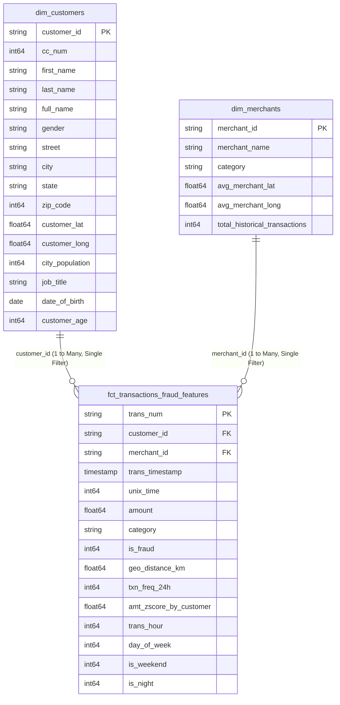

# 📐 Xóm Bank — Power BI Data Model Specification (Star Schema)

> **Dataset nguồn:** Google BigQuery (`xombank-fraud-analytics.xombank_dw_marts`)  
> **Kiến trúc mô hình:** Star Schema chuẩn (Kimball Dimensional Modeling)  
> **Phương thức kết nối khuyến nghị:** **Import Mode** (để tối ưu tốc độ DAX & tính toán) hoặc **DirectQuery** (cho dữ liệu lớn cập nhật tức thì).

---

## 1. Sơ đồ Quan hệ Mô hình (Entity Relationship Diagram)



---

## 2. Chi tiết các Mối quan hệ (Relationships)

| Bảng Đầu (From / Dimension) | Khóa Đầu (PK) | Bảng Cuối (To / Fact) | Khóa Cuối (FK) | Tính chất (Cardinality) | Hướng Lọc (Cross filter direction) |
|---|---|---|---|---|---|
| `dim_customers` | `customer_id` | `fct_transactions_fraud_features` | `customer_id` | **1 to Many (1:*)** | **Single (dim ➔ fact)** |
| `dim_merchants` | `merchant_id` | `fct_transactions_fraud_features` | `merchant_id` | **1 to Many (1:*)** | **Single (dim ➔ fact)** |

> [!IMPORTANT]
> **Nguyên tắc thiết kế Model:** Luôn giữ Cross Filter Direction là **Single**. Không dùng bi-directional filtering để tránh sai lệch context chuyển tiếp và suy giảm hiệu năng DAX.

---

## 3. Cấu hình Cột & Định dạng Hiển thị (Data Types & Formatting)

### A. Bảng `fct_transactions_fraud_features`
- `amount`: Decimal Number $\rightarrow$ Format `$#,##0.00`
- `geo_distance_km`: Decimal Number $\rightarrow$ Format `#,##0.0 \k\m`
- `amt_zscore_by_customer`: Decimal Number $\rightarrow$ Format `+0.00;-0.00;0.00`
- `txn_freq_24h`: Whole Number $\rightarrow$ Format `#,##0`
- `is_fraud`: Whole Number (0 hoặc 1) $\rightarrow$ Ẩn khỏi trường người dùng cuối (dùng qua Measure `[Fraud Rate %]`)
- `is_weekend` / `is_night`: Whole Number (0 hoặc 1)
- `trans_timestamp`: DateTime $\rightarrow$ Format `yyyy-MM-dd HH:mm:ss`

### B. Bảng `dim_customers`
- `customer_lat` / `customer_long`: Data Category $\rightarrow$ **Latitude / Longitude** (để vẽ bản đồ Power BI Map)
- `state`: Data Category $\rightarrow$ **State or Province**
- `city`: Data Category $\rightarrow$ **City**
- `customer_age`: Whole Number $\rightarrow$ Tạo thêm Calculated Column hoặc Grouping Bin:
  ```dax
  Age Group = 
  SWITCH(
      TRUE(),
      dim_customers[customer_age] < 25, "< 25",
      dim_customers[customer_age] <= 35, "25 - 35",
      dim_customers[customer_age] <= 50, "36 - 50",
      dim_customers[customer_age] <= 65, "51 - 65",
      "> 65"
  )
  ```

### C. Bảng `dim_merchants`
- `avg_merchant_lat` / `avg_merchant_long`: Data Category $\rightarrow$ **Latitude / Longitude**
- `category`: Text $\rightarrow$ Phân loại ngành hàng
